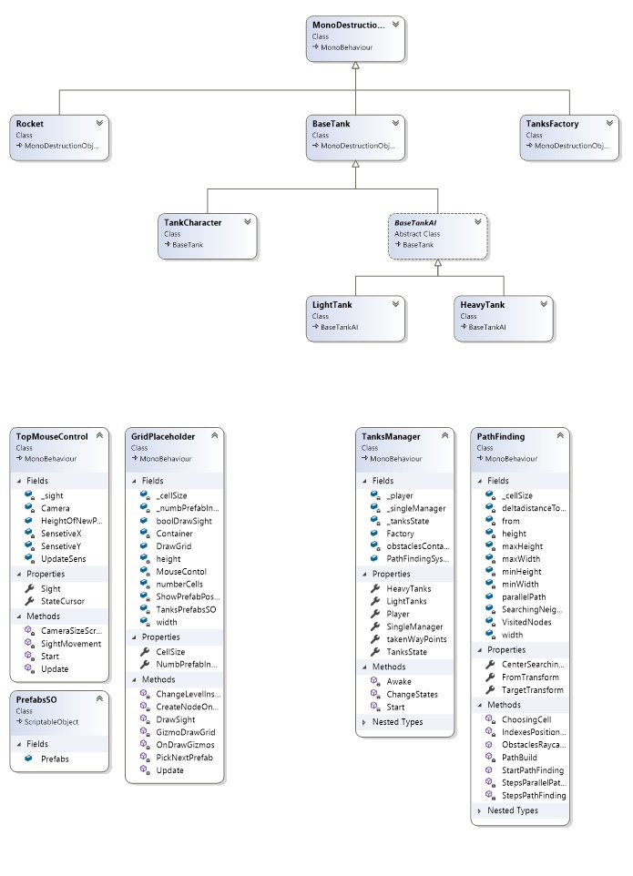

# PresentTanks

Это небольшая игра-танчики разработанная на Unity. Игра является мини-игрой в другом дружеском проекте. Все классы в диаграмме классов разработанны собственными усилиями.

В проекте есть 2 сцены, одна для создания уровней игры, другая - сама игра.
В игре есть класс TanksManager, в полях которого содержатся ключевые экземпляры игры - Pathfinding, Player, Factory и 2 листа с легкими и тяжелыми танками. В зависимости от состояния этих объектов, TankManager выбирает состояние танков, благодаря чему в любой момент времени танки могут быстро переключать своё поведение. В остальном роль TanksManager, только в инициализации и содержании важных полей и свойств.

Pathfinding, это класс ответственный за поиск пути от танка запрашивающего путь, до игрока или обходной позиции. Там реализован алгоритм A* (A-star), в частности довольно стандартная релизация с пространством поделенным на квадратные клетки, и поиском путей внутри этой сетки. Публичный метод StartPathFinding() запускает поиск пути и возвращает List<Vector3> с позициями получившегося пути. Перед вызовом метода необходимо присвоить свойствам FromTransform, TargetTransfrom и CenterSearchingZone, Transform-экземпляры танков из которого ищется путь, до которого ищется путь, и трансформ на центр зоны поиска, вокруг которой и строится сетка и ищется путь.

## Как можно заметить в диаграмме есть 4 уровневая иерархия классов.

MonoDestructionObjects, наследуется от класса MonoBehavior и позволяет благодаря этому повесить себя в качестве компонента к любому игровому объекту, например этот скрипт можно повесить на gameobject камня или кирпича, и при попадании рокеты в камень или кирпич, в методе OnCollisionEnter, у камня отнимится через свойство HP, и в случае если HP обнулится то gameobject со скриптом уничтожатся.

от MonoDestructionObjects наследуется классы Factory, Rocket и BaseTank. Соответственно они тоже могут разрушаться. Рокета просто движется вперед с указанным Direction и скоростью. Factory строит вражеские танки через некоторое время с некоторыми параметрами и проверяет ли соблюдается ли пропорции количества выпущенных легких и тяжелых танков, и выпускает следующие танки в зависимости от текущих пропорций. BaseTank описывает внутри общие для всех танков методы и поля.

От BaseTank наследуются TankCharacter и BaseTankAI. TankCharacter содержит обработку Input-ввода игрока и соответственно обрабатывает Character танка. BaseTankAI содержит множество общих методов и свойств, для легкого и тяжелого танка, которые выполняют небольшие, простые действия делающие конкретную функцию. Например там есть методы для выбора точки в которую будет двигаться танк, или методы для передвижения танка и т.д. Простые действия из которых можно строить тактические модели.

В классах LightTank и HeavyTank, выбирается в зависимости от состояния танков в TankManager, тактика-метод. Но так оказалось что в проекте оказалось достаточно 1 единственной простой тактики. Однако ни что не мешает на каждое состояние составить-написать свою тактику для танков.

## P.s. Про вторую сцену для создания уровней.

Классы GirdPlaceholder, TopMouseControl и PrefabsSO нужны для сцены создания уровней, первый класс, для отрисовки сетки и расположения блоков, TopMouseConrol для Input-а дизайнера карты (+,- около нампада масштабируют камеру, нажатие мыши строит/удаляет блок, Q/E выбирают высоту блока, scroll колесика мыши выбирает блок) PrefabsSO нужен для создания ScriptableObject с листом префабов блоков, среди которых выбирается блок на колесико мыши.

